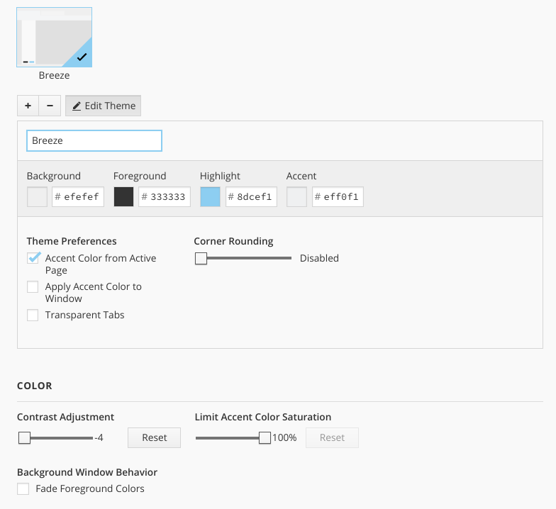

# Vivaldi-Breeze
Tweaks to the Vivaldi browser to match KDE/Plasma Breeze theme. 
In order to add these tweaks to Vivaldi, place the CSS files in a new folder,
then go to vivaldi://experiments/ and enable "Allow for using CSS modifications",
finally in vivaldi://settings/ got to Custom UI Modifications and select the folder that you just created.

1. tabs.css: change the look of tabs to match more closely the one of KDE. Should be used with a theme with the following settings
(you can use the accent color or not according to your taste, and also add some rouded corners if you want, the theme will still work)

2. buttons.css: if you want to use the non-native window (which saves quite a bit of vertical space),. this file will reskin the maximize/minimize/close buttons to match (as closely as possible) those of Breeze window decorations.
3. non-native-window-with-shadow-kde.mp4: a little tutorial that shows how to have window shadow when using non-native window. You may want to combine this with [KDE shapecorners](https://sourceforge.net/projects/shapecorners/) plugin to have rounded window corners.

## Known bugs
1. Stacked tabs do not look nice (they do not look nice in plain Vivaldi either)
2. When "Start page" tab is not in foreground, an ugly favicon background is displayed.
3. Close button does not change color when window is active (probably unfixable)
4. Title bar button glyphs are slightly smaller (this is caused by the original SVG being just 10x10, hard to fix)
